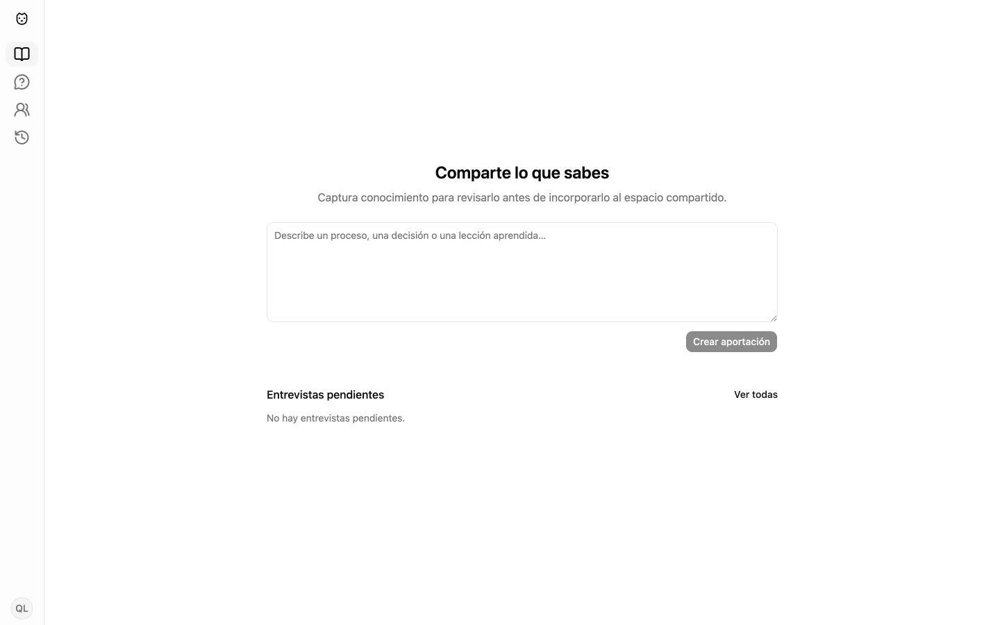

# Knowli

Knowli is a portfolio project about a simple idea: shared knowledge should be
reviewed before an AI can retrieve it. Registered people contribute what they
know, review the claims the model extracts, resolve possible contradictions,
and only then publish them for everyone to ask about.

It demonstrates a production-shaped, local-first AI application without
pretending that an LLM is the source of truth: authentication, human approval,
resumable workflows, cited retrieval, browser tests, and one-command local
startup all fit in one approachable codebase.



## What it does

- Lets registered users capture a contribution by typing or dictating.
- Extracts small, reviewable claims and pauses for human approval.
- Finds related claims, asks the contributor to resolve meaningful overlap, and
  preserves lineage when a newer claim replaces an older one.
- Supports direct interview requests between registered users; an answer enters
  the same review flow as a voluntary contribution.
- Answers questions only from approved claims and returns citations.
- Keeps a shared history of committed contributions.

## Quick start

```bash
cp .env.example .env
# Set OPENAI_API_KEY in .env when using OpenAI.
docker compose up --build
```

Open [http://localhost:3000](http://localhost:3000), create an account, and
start contributing. The API starts without an OpenAI key, but capture and Ask
need a configured model to produce useful results.

## Test and check

```bash
uv run --directory backend pytest -q
npm --prefix frontend test
npm --prefix frontend run lint
npm --prefix frontend run build
./scripts/check-product-language.sh
docker compose config
./scripts/smoke-local.sh
```

The smoke check expects the local stack started by the quick-start command.
For deterministic end-to-end browser coverage, use the repository's separate
Compose override and run `npm --prefix frontend run test:e2e`.

## Project map

| Path | Purpose |
| --- | --- |
| `frontend/src/` | React interface, routes, feature pages, translations, and component tests. |
| `backend/knowli/domain/` | Stable business values and ports. |
| `backend/knowli/application/` | Review, Ask, account, and interview use cases. |
| `backend/knowli/infrastructure/` | PostgreSQL, embeddings, model, speech, and E2E implementations. |
| `backend/knowli/interfaces/http/` | FastAPI routes, request schemas, authentication, and error mapping. |
| `docs/` | Architecture, concepts, decisions, local setup, and a guided code tour. |
| `scripts/` | Local smoke and language-boundary checks. |

## Read next

- [Architecture](docs/architecture.md) — the runtime shape and boundaries.
- [Concepts](docs/concepts.md) — the vocabulary behind reviewed retrieval.
- [Learning guide](docs/learning-guide.md) — follow four requests through the code.
- [Decisions](docs/decisions.md) — the deliberate trade-offs.
- [Local models](docs/local-models.md) — model and speech configuration.

## License

Apache-2.0
