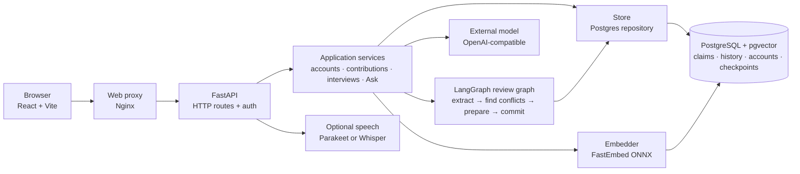

# Architecture

Knowli is one shared, global knowledge space. Accounts identify authors and
protect the application; they do not partition what can be retrieved. A claim
becomes searchable only after its contributor reviews it.

The browser talks only to the web service. Its proxy forwards `/api` and the
speech websocket to FastAPI, while serving the React application itself.
FastAPI authenticates the request, validates its JSON with Pydantic, and calls
an application service. The service is where the product rules live; it uses
the graph for the contribution workflow and the store for durable data.

## The contribution graph

`backend/knowli/application/review.py` compiles a four-stage LangGraph flow:

1. `extract_claims` asks the model for standalone claim drafts and pauses for
   the contributor to edit or remove them.
2. `find_conflicts` embeds each approved draft, retrieves likely existing
   claims, asks the model to classify the overlap, and pauses again.
3. `prepare_commit` validates every human decision and builds the exact claims
   that may be stored.
4. `commit_claims` writes those claims and any replacement links in one store
   operation.

The graph checkpoint uses the contribution ID as its LangGraph thread ID. That
makes a paused review resumable after a process restart without a second,
competing workflow-state table.

## Layers and ownership

| Area | Responsibility |
| --- | --- |
| `backend/knowli/interfaces/http/` | Routes, cookies, request/response schemas, Server-Sent Events, and translating known errors to HTTP. |
| `backend/knowli/application/` | Use cases: login, contributions, interviews, Ask, history, authorization, and workflow progression. |
| `backend/knowli/domain/` | Typed claims, users, interview values, review policy, and the ports that the application needs. |
| `backend/knowli/infrastructure/` | Concrete PostgreSQL repository, LangGraph checkpointer, OpenAI adapter, FastEmbed, and optional speech engines. |
| `backend/knowli/wiring.py` | The composition root that connects ports to implementations. |

The dependency direction is intentionally inward: HTTP calls application code;
application code depends on domain ports; infrastructure implements those
ports. `wiring.py` is the one place allowed to know all concrete choices.

## Data and retrieval

PostgreSQL stores account sessions, interview requests, contributions, claims,
and review checkpoints. The `claim` table has a vector embedding, a generated
full-text search column, and a `superseded_by` link. A replacement therefore
preserves what was previously believed instead of deleting it.

`PostgresStore.search_claims()` combines semantic and lexical candidate lists
with reciprocal rank fusion (RRF). Semantic search handles paraphrases;
full-text search catches exact terms such as version numbers and error codes.
Ask passes the fused results to the model, then returns citations only for
claim IDs the model selected from that retrieved set.

## Why this is a modular monolith

Knowli deploys as one web application and one database because that keeps local
startup, transactions, migrations, and debugging straightforward. It is still
modular: the domain ports isolate integrations, the application services make
use cases visible, and the HTTP boundary prevents framework details from
leaking into the rules. Splitting these modules into network services now would
add operational cost without a demonstrated need.

## Deferred protocols

The protocol surface is deliberately deferred. The current product is a
browser-first, authenticated application with a small, stable HTTP surface. An
additional protocol server would introduce another public boundary, security
model, and compatibility commitment before there is a real external consumer.
The domain ports keep that future option open without shipping it prematurely;
the explicit protocol decision is recorded in [Decisions](decisions.md).
